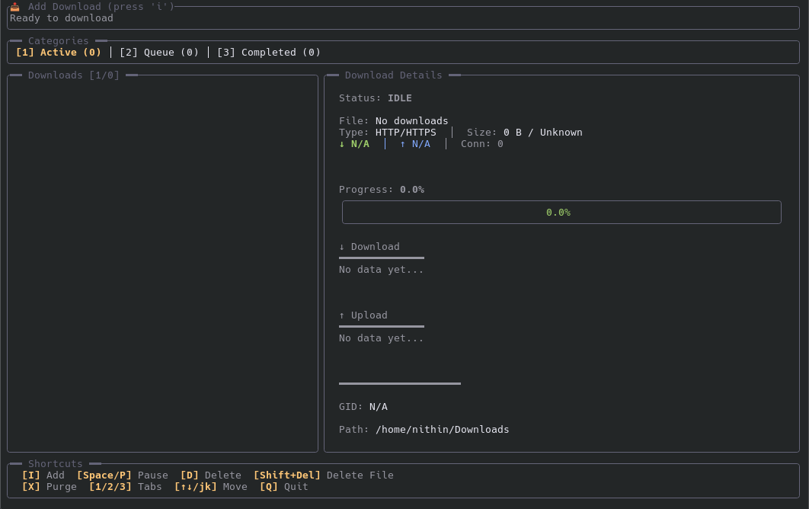

# TUI Downloader

A modern terminal-based download manager powered by aria2c.



## Features

- 🚀 Multi-protocol support (HTTP/HTTPS, FTP, BitTorrent, Metalink)
- 🎨 Beautiful terminal UI with real-time progress tracking
- ⚡ Automatic aria2c management
- 📊 Live download/upload speed graphs
- 🔄 Pause, resume, and manage downloads

## Prerequisites

Install aria2c:

```bash
# Ubuntu/Debian
sudo apt install aria2

# Fedora
sudo dnf install aria2

# Arch Linux
sudo pacman -S aria2

# macOS
brew install aria2
```

## Installation

```bash
git clone https://github.com/yourusername/tui-downloader.git
cd tui-downloader
cargo build --release
```

## Usage

```bash
cargo run
# or
./target/release/tui-downloader
```

## Keyboard Shortcuts

- **`i`** - Add new download
- **`Space/p`** - Pause/Resume
- **`d`** - Delete from list
- **`Shift+Delete`** - Delete file from disk
- **`1/2/3`** - Switch tabs (Active/Queue/Completed)
- **`↑↓` or `j/k`** - Navigate
- **`q`** - Quit

## Supported Formats

- URLs: `https://example.com/file.zip`
- Magnet links: `magnet:?xt=urn:btih:...`
- Torrent files: `/path/to/file.torrent`
- Metalink: `.metalink` or `.meta4` files

## License

MIT License - See LICENSE file for details.
